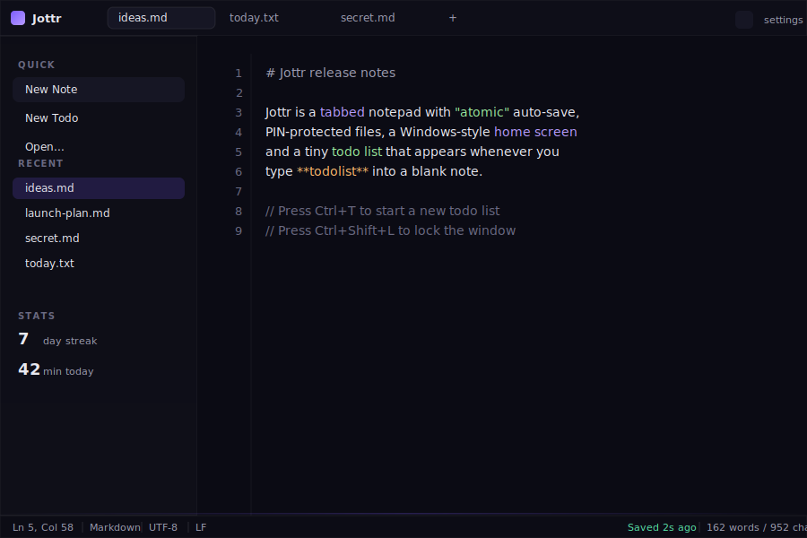
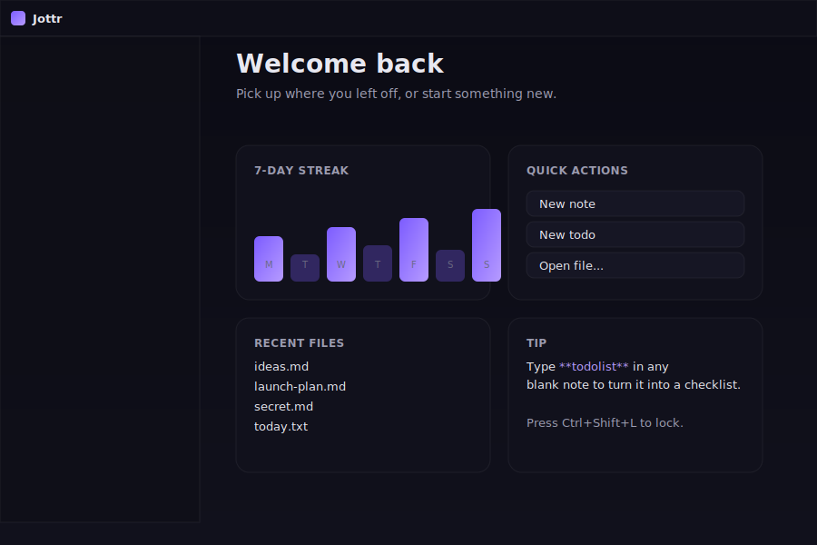
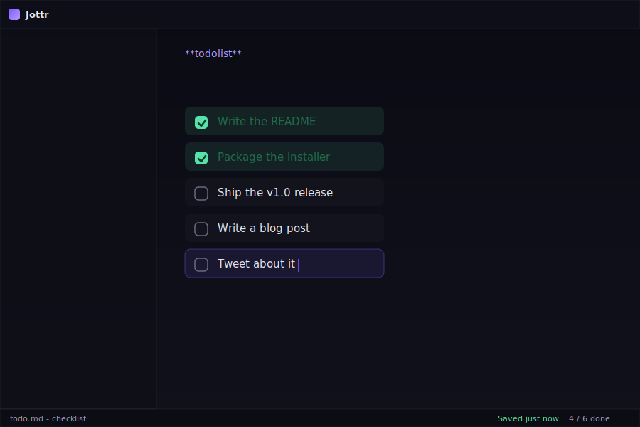

<div align="center">


# Jottr v2.1

**A simple tabbed notepad**

[](../../releases)
[]()
[]()
[]()

[Download](../../releases) &middot; [Features](#features) &middot; [Screenshots](#screenshots) &middot; [Build](#building) &middot; [Website](https://yourname.github.io/jottr/)

</div>

---

## Why Jottr?

Jottr is the notepad that **doesn't lose your work and doesn't get in
your way**. It sits in your tray, opens with a hotkey, asks for a PIN
when you walk away, and saves every keystroke atomically - so a crash,
a power loss or a yanked USB cable can never eat your text.

It looks at home on Windows 11, but it's a tiny Python+webview app,
so it runs anywhere Python and a browser engine do.

**Jottr 2.1** adds folders, drag-and-drop, color tags, PIN-per-file
(config-stored, not file headers), a plugin system (`.plugg` files),
collapsable widgets and sidebar, smooth animations, and a one-file
PyInstaller spec for a single standalone `Jottr.exe`.

---

## Features

### Editor

- **Tabs** with per-tab dirty indicators, middle-click close and
  `Ctrl+Tab` cycling.
- **Atomic auto-save** with debounce + `fsync` + atomic rename.
  Auto-save is **silent**: it never reloads the document, never
  resets the caret, and never flickers the cursor mid-typing.
- **Markdown** highlighting (headings, bold/italic, code, links).
- **Preview mode** with eye toggle (Ctrl+Shift+V) - hides the
  editor and renders the note with proper headings, code blocks,
  lists, blockquotes and inline formatting. In preview mode you
  can still **click a todo checkbox** to mark an item done.
- **Search** (Ctrl+Shift+H on the home screen) - filters across
  every note by content with snippets.
- **Line numbers** with an active-line indicator and live `Ln/Col`
  status.
- **Find / Replace** (Ctrl+F) with case-sensitive and whole-word
  options, plus replace-one and replace-all.
- **Multiple themes**: Midnight, Graphite, Dusk, Paper, Solarized.
  Cycle with Ctrl+Shift+P.
- **Configurable font size, word wrap, line numbers** from Settings.
- **Drag and drop** any `.md` / `.txt` file onto the editor to
  import it as a new note.

### Files

- Notes live in `notes/` next to the executable as plain `.md` /
  `.txt` files - **yours to keep forever**, syncable with Dropbox,
  git, Syncthing, whatever.
- **Recent files** list in the sidebar and on the home screen.
- **Pin favorite notes** to a dedicated sidebar section - right-click
  any file in Recent and choose "Pin to sidebar".
- **Reveal in Explorer** from the right-click menu.
- **Rename** and **delete** from the right-click menu.
- **Open with Jottr** registers an Explorer context-menu entry
  (one toggle in Settings).
- **Custom accent color** - pick any color in Settings or cycle
  through presets. The active tab indicator, buttons and highlights
  follow it instantly.

### Security

- **App-wide PIN** with SHA-256 + per-install salt, stored locally.
- **Per-file PIN** stored as an HTML-comment header (`<!-- pin:... -->`).
- **Lock now** (`Ctrl+Shift+L`) and **auto-lock on minimize** (when
  the app goes to the tray).
- PIN entry lives in a single input - no keyboard hooks, no
  accessibility services.

### Productivity

- **Tray icon** (pystray) with Show / New Note / Lock / Quit.
- **Global hotkey** to summon Jottr (default `Ctrl+Alt+J`,
  fully configurable).
- **Launch at Windows startup** (per-user registry, no admin).
- **Home screen** with widgets: 7-day streak bar chart, quick
  actions, recent files and a rotating tip.

### Todo lists

Type the word `**todolist**` into a blank note and it instantly
transforms into a structured checklist:

- `Enter` adds a new item, focus jumps to it.
- `Backspace` on an empty item removes it and jumps back.
- **Paste a list of lines** - each non-empty line becomes its
  own todo item, perfect for converting a copied-out checklist
  into an interactive one in a single keystroke.
- Click the box to toggle done: the item turns **green with a
  dark-green strikethrough**, so completed work is obvious at a
  glance.
- In **Preview mode** (Ctrl+Shift+V) the same checklist renders
  read-only with the same green-done styling.

The same note remains a valid Markdown file on disk, so your
todos are still diff-able, greppable and version-controllable.

### Stats

- **7-day edit streak** (consecutive days with at least one save).
- **Minutes today** (rough; bumps on each save).
- **All-time word count**.
- Per-day edit counts drawn as a bar chart on the home screen.

---

## Screenshots

| Editor | Home screen | Todo list |
|:------:|:-----------:|:---------:|
|  |  |  |

---

### Plugins

Jottr ships a tiny plugin system: drop a `*.plugg` file into the Jottr
install dir and it shows up in **Settings -> Plugins**. Each plugin
is just a Python module with a `register()` function (and optionally
`activate(api)` / `deactivate()`).

The bundled first-party plugin, **Note Encryptor** (`encrypt_decrypt.plugg`),
adds right-click menu items to encrypt/decrypt individual notes with a
password. It's zero-dependency (XOR + base64) and lives in `plugins/`.

See **`syntax.plugg`** in the repo root for the full grammar of the
manifest format.

### Folders

Notes can be organized into folders. Right-click a folder to create
new notes inside, rename or delete. Notes can be **dragged from the
sidebar onto a folder** to move them. Per-folder PINs apply to every
note inside.

### Color tags

Every note and folder can have a **color tag** (set via the right-click
menu). The sidebar icon and the recently-used widget pick up the
color. Default: **purple for folders, grey for files**.

### Collapsible widgets & sidebar

Click any widget header on the home screen to collapse / expand it.
Same for sidebar sections - the collapsed state persists across
sessions in `config.json`.

### Animations

Every transition in the UI is animated: tab switches, panel
collapses, toast popups, settings opening/closing, drag-over
highlights, and the home screen widgets slide in on load.

## Quick start

### Run from source

```bash
git clone https://github.com/Compromisee/Jottr.git
cd jottr
python -m venv .venv && source .venv/bin/activate   # Windows: .venv\Scripts\activate
pip install pywebview pystray pillow keyboard
python jottr.py
```

### Download a build

Grab the latest installer or portable `.exe` from
[**GitHub Releases**](../../releases).

- `Jottr-Setup-1.0.0.exe` - per-user installer (no admin needed)
- `Jottr.exe` - portable single-file build

See [`packaging.md`](./packaging.md) for full packaging instructions
including PyInstaller, Inno Setup, macOS `py2app`, Linux AppImage
and GitHub Actions release builds.

---

## Building

```bash
pip install pywebview pystray pillow keyboard pyinstaller

pyinstaller --noconfirm --windowed --onefile \
  --icon assets/icon.png \
  --add-data "ui;ui" --add-data "assets;assets" \
  --collect-all pystray --collect-all pywebview \
  --hidden-import keyboard \
  jottr.py
# -> dist/Jottr.exe
```

For an installer, see [`packaging.md`](./packaging.md) section 4.

---

## Keyboard shortcuts

| Shortcut | Action |
|---|---|
| `Ctrl+N` | New note |
| `Ctrl+T` | New todo |
| `Ctrl+O` | Open file... |
| `Ctrl+S` | Force save |
| `Ctrl+W` | Close tab |
| `Ctrl+F` | Find / replace |
| `Ctrl+P` | Open Settings |
| `Ctrl+Tab` | Cycle tabs |
| `Ctrl+Shift+V` | Toggle preview mode |
| `Ctrl+Shift+P` | Cycle theme |
| `Ctrl+Shift+H` | Focus home search |
| `Ctrl+Shift+V` | Toggle preview |
| `Ctrl+Shift+L` | Lock now |
| `Ctrl+Alt+J` | Toggle window (configurable) |

---

## Configuration

All settings live in `config.json` next to the executable. The
file is human-editable but the recommended path is the in-app
Settings dialog. Useful keys:

| Key | Default | Notes |
|---|---|---|
| `theme` | `midnight` | `midnight`, `graphite`, `dusk`, `paper`, `solar` |
| `pin_scope` | `app` | `app` or `per_file` |
| `global_hotkey` | `ctrl+alt+j` | Anything `keyboard` understands |
| `font_size` | `14` | Pixels |
| `word_wrap` | `false` | |
| `startup` | `false` | Windows only |

PINs are hashed with SHA-256 + a per-install salt; the raw PIN
is never written to disk.

---

## How atomic auto-save works

On every keystroke Jottr:

1. Updates the in-memory buffer (no DOM swap, no caret reset).
2. Schedules a debounced save 600 ms after the last keystroke.
3. On flush, writes to a sibling `.tmp` file, `fsync()`s it, then
   `os.replace()`s it onto the real path.

`os.replace()` is atomic on every modern filesystem, so the file
on disk is always either the previous version or the new version -
never half-written, never missing.

And because the buffer is **never overwritten** with the file
contents during a save, your caret stays exactly where you left
it. That's the part that matters most and the part most editors
get wrong.

---

## Architecture

```
+-------------------+        +---------------------+
|   Python process  |        |  WebView (Edge/WK)  |
|   - jottr.py      |  js    |  - ui/index.html    |
|   - backend.py    | <----> |  - ui/style.css     |
|   - tray, hotkey  |  api   |  - ui/app.js        |
+-------------------+        +---------------------+
        |  ^
   atomic writes   global hotkey, tray, registry
        v  |
   notes/*.md, config.json
```

- `jottr.py` creates the window and starts the background threads.
- `backend.py` is the single Python object exposed to JS via
  `webview.create_window(js_api=...)`.
- `ui/app.js` is a hand-written controller - no framework, ~600
  lines, easy to hack on.

---

## Contributing

Pull requests welcome. The whole UI is one HTML file, one CSS
file and one JS file - fork it and have fun.

If you add a feature, please:

1. Keep the no-framework rule (vanilla JS only).
2. Don't introduce an emoji; use Material Symbols Outlined.
3. Make sure atomic auto-save still doesn't reset the caret.
4. Add a smoke-test bullet to `packaging.md`.

---


## License

MIT. See [`LICENSE`](./LICENSE).
